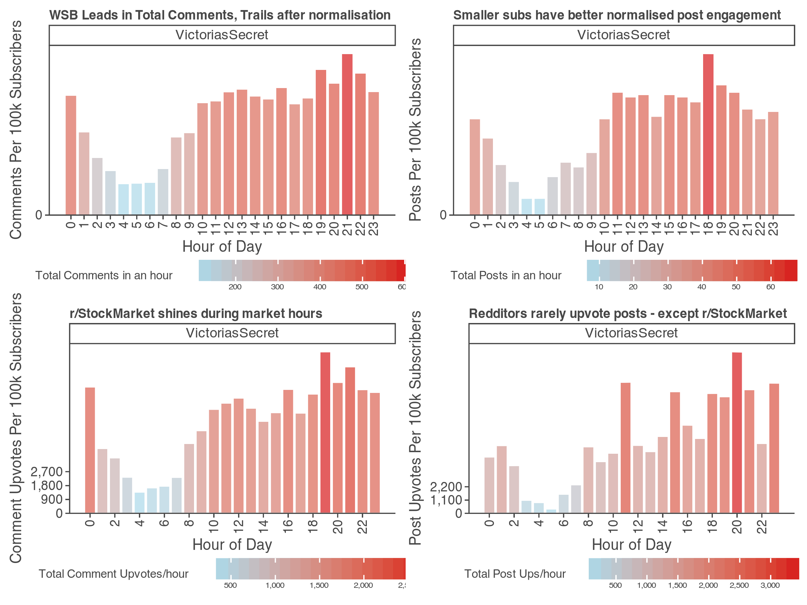

**Summary**

This research aims to examine how retail investor activity has shifted during periods of market uncertainty under the Trump Administration, focusing on finance-related subreddits. By analyzing post and comment activity across
r/wallstreetbets (18M), r/investing (3M), r/stocks (8.5M) and r/stockmarket(3.5M) the study tracks participation trends through quantifiable metrics like posting frequency, comment frequency, and upvotes. These metrics are normalized by subscriber counts for a more accurate representation of engagement. Post, comment and subreddit data is gathered using Reddit's API, processed into structured formats, and stored in an SQLite database for efficient querying. Aggregations are made on both daily and hourly levels to reveal patterns in retail investor behavior. 

**Analysis**

Graph 1: Each row has a comparison of accumulated daily data split by subreddit (left chart) and normalised on a per 100k subscriber basis (right chart) 

Across all the charts, we see that there is a sustained uptick in activity for certain dates - March 3rd to 8th, March 10th and March 28 and April 1st remain notable key instances. These happen to coincide with key market events as outlined by our reference table in NB02 where, for instance, on March 3rd President Donald Trump stated that he would implement 25% tarrifs on Canada and Mexico and March 6 - the midpoint of the week where the market went into a sustained downturn, even entering correction territory according to some opinions. This is just one example, and there are many others in the data that suggest a correlation between market news and retail investor activity on investing subreddits, as measured by our metrics, even on a normalized basis. Specifically, on March 4th, post upvotes are the only graph where r/investing doesn't peak, suggesting that subscribers in the subreddit favor other forms of performance. This highlights how, across subreddits, different metrics may be a better measure of investor response and activity.

At the daily level, despite continuation of this negative market activity on March 10th, March 8 and 9 don’t show much activity across both total and normalised metrics, especially for the raw and normalised comment upvotes - more clearly shown by sharp drops in the subreddits with lower subscriber count.  This could be explained by something we didn’t consider in our analysis - weekends. March 8 and 9th were Saturday and Sunday respectively, days where the market is closed. This suggests that during days where markets are closed, there seems to be less activity on subreddits. 

Although we cannot say this relationship is causal, the correlation seems to be even stronger on a hourly basis, demonstrated in graph 2 below:

Graph 2: This graph plots normalised data on hourly data in the New York timezone with a heatmap that shows total data and splits by subreddit. 

Across all 4 graphs our data supports our previous conclusion, that during market hours, between hour 9 to 17, (the stock market is open 9:30am to 4:30pm New York time) retail investor activity trends higher by a significant margin. In fact, we again see that the effect is a lot more pronounced on a normalised basis for the smaller subreddits. Here, we can see the importance of normalisation more concretely, where in the top left graph, r/wallstreetbets switches from having the most comments in absolute values, to having the least relative to it’s size. Across the board, we see a surprising amount of activity during hour 5 which seems remarkably early to post about US markets. However, this reveals another bias in our data, that we are only focused on the US market. Looking at the European market, which opens at 8 AM GMT (about 4 AM New York time), suggests that those who want an early start could be posting about information that would affect international stocks, resulting in increased activity.

**Evaluation**

In evaluating our analysis, several important factors need to be considered. First, the growth in subreddit subscriber counts over time is not accounted for in this study. We are only using the current number of subscribers, which may not fully reflect historical trends or shifts in audience size. This is particularly relevant when examining changes in engagement and activity over time. Additionally, while we focused on r/stockmarket for our hourly data, it has the largest sample size and is thus the most representative. However, this also introduces subreddit bias, as different subreddits cater to different types of retail investors. For example, r/wallstreetbets has a more “meme-oriented” approach (e.g., the GameStop incident), which may attract a different crowd than 
r/investing**, potentially skewing comparisons.

Another issue is the treatment of weekends. Our analysis doesn’t account for the fact that weekends may experience lower activity, as shown by the lack of activity on March 8th and 9th. Since markets are closed, investors may be less active on these days, suggesting a need for separate weekend analysis to avoid data bias.

**Conclusion**

In conclusion, the findings suggest that retail investor activity on finance-focused subreddits is closely tied to significant market events and periods of uncertainty. Notable spikes in activity were observed on dates aligning with key market developments during the Trump Administration, such as tariff announcements and market downturns. These results indicate a potential correlation between political and economic news and retail investor engagement. However, the analysis also reveals important limitations, such as the failure to account for subscriber growth, subreddit biases, and the influence of weekends on activity patterns. Additionally, while New York time was used for hourly analysis, global market activity could offer further insights. Overall, the study provides valuable insights into retail investor behavior during uncertain market conditions, but future research should address these limitations for a more comprehensive understanding, covering a greater number of subreddits and segmenting the data depending on days of the week and subreddits. This process could also be used as groundwork for sentiment analysis, parsing comment and post text and training a machine learning model using supervised learning to predict stock market signals.